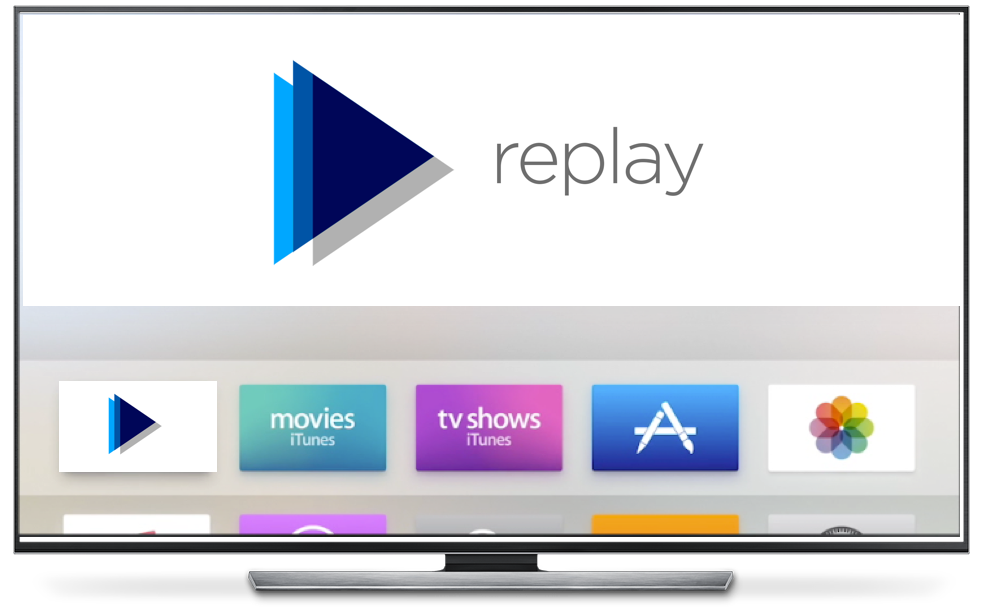

# Replay

tvOS application that converts an Apple TV into to a digital signage / kiosk

## Highlight Features

- Plays video on launch and runs in a loop
- Caches video for replay, conserving network bandwidth 
- Allows for airplay mirroring on top of the video and resumes once session is terminated
- In conjunction with MDM, can be locked onto screen without any input from remote or remote app (on iPhone) to be a true Kiosk!


## Description

The application is designed to start a video on launch and keeping running in an infinite loop. The video being played can be hosted in any public facing server. If you don't have any servers that you can host the videos on, a free AWS S3 account (Free storage up to 5GB) can be used.

## How does Replay cache videos?

Videos are cached locally as application data with one complete run of the video (advise two just to be safe)

## Supported Video Formats

-	H.264 video up to 1080p, 30 frames per second, High or Main Profile level 4.0 or lower, Baseline profile level 3.0 or lower with AAC-LC audio up to 160 Kbps per channel, 48kHz, stereo audio in .m4v, .mp4, and .mov file formats
-	MPEG-4 video up to 2.5 Mbps, 640 by 480 pixels, 30 frames per second, Simple Profile with AAC-LC audio up to 160 Kbps, 48kHz, stereo audio in .m4v, .mp4, and .mov file formats 
-	Motion JPEG (M-JPEG) up to 35 Mbps, 1280 by 720 pixels, 30 frames per second, audio in ulaw, PCM stereo audio in .avi file format

## Customization

To customize the applcation for your needs, follow the steps below:

STEP 1: Update the bundleID and link your Apple Developer Account

STEP 2: Edit the URL for the video that you'd like to play 

```
// URL of the Video
    let media = "http://commondatastorage.googleapis.com/gtv-videos-bucket/sample/BigBuckBunny.mp4"
"
```

STEP 3 (Optional): Customize the Icon and Top Shelf images

Here's a [link](https://developer.apple.com/design/resources/) to Apple's design resources for template
For more information on icon and top shelf images for tvOS, Refer [this] (https://developer.apple.com/tvos/human-interface-guidelines/icons-and-images/)

## Deployment

Apple has made significant improvements to management capabilities of Apple TVs on tvOS 10.2 with the introduction of [DEP](https://support.apple.com/en-us/HT204142) and Enterprise Application Management.

### Enrollment

- DEP on tvOS allows for a true Zero-Touch deployment with the a mode known as "Auto Advance Setup" - which when configured in the DEP profile assigned to the Apple TV, allows the Apple TV to enroll into MDM and skip all the screens to go straight to the spring board within 30seconds of network active when connected to Ethernet. 

Essentially, the deployment steps would be 
1) Connect Apple TV to power 
2) Connect to Ethernet and wait 30 seconds and watch the rest unfold

*NOTE:* With the "Auto Advance Setup", do not pair the remote / tap to setup during the first 30 seconds, the key is to power on Apple TV and just wait.

### Application Management

- Enterprise developed applications can now be managed for tvOS and be downloaded and installed automatically on enrollment. Replay application can hence be effectively managed using VMware AirWatch to transform a display to true Digital Signage

### Configuration Policies

- Once the application has been installed, a configuration policy known as 'Single App Mode' with the reference of the bundle ID of this application can be deployed to the devices to automatically launch the applicaiton and lock it to the screen
- In addition to the 'Single App Mode' policy, there are few more restrictions that can be added on top to enforce security such as : 1) Force incoming Airplay Requests for pairing password 2) Restrict pairing Remote app (iPhone)


